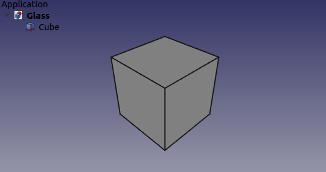

# Glass
Overlay dock widgets over viewport.

### Installation
Glass module can be installed via the FreeCAD [Addon Manager](https://github.com/FreeCAD/FreeCAD-addons#1-builtin-addon-manager). 

#### Manual installation:

Install path for FreeCAD modules depends on the operating system used.

##### Examples:

Linux:

`/home/user/.FreeCAD/Mod/Glass/InitGui.py`

macOS:

`/Users/user_name/Library/Preferences/FreeCAD/Mod/Glass/InitGui.py`

Windows:

`C:\Users\user_name\AppData\Roaming\FreeCAD\Mod\Glass\InitGui.py`

### Requirements
Qt 5 (and up) enabled FreeCAD build.

### Usage
Glass module will set defaults on the first run. For activating the Tree view an additional restart of FreeCAD might be needed. For toggling the overlay mode press the Q+1 key combination on the keyboard. Q+2 key combination can be used to toggle visibility.

[A video on YouTube](https://www.youtube.com/watch?v=ny31diN1ZhM) was created by OficineRobotica demonstrating configuration and customization of Glass module. It is used as the default style for Glass and it is set on the first run.

### Discussion
Feedback can be posted to this [FreeCAD forum thread](https://forum.freecadweb.org/viewtopic.php?f=34&t=32397)

